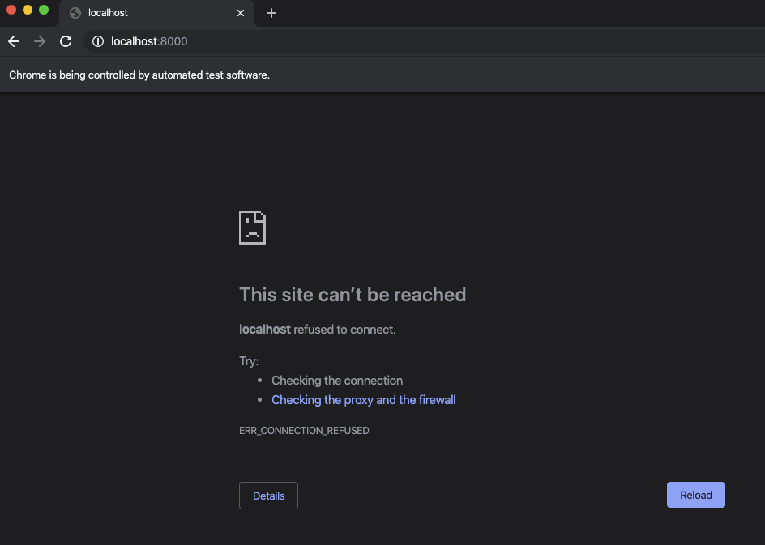
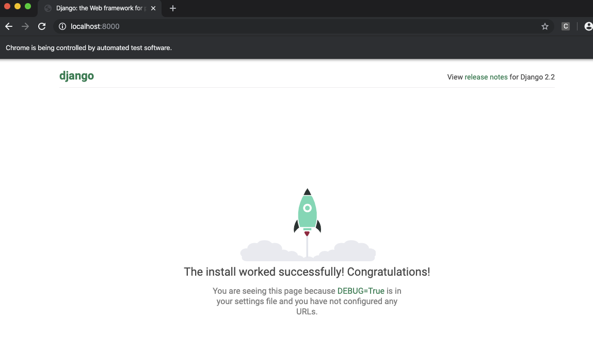

# 1장 기능 테스트를 이용한 Django 설치


## 테스팅 고트님께 복종하라! 테스트가 없으면 아무것도 하지 마라!(예제 : [01-01](./01-01))

### Testing Goat

- 염소가 소리친다. "테스트를 먼저 해! 테스트를 먼저 하라고!"
- 사실 개발할 때는 잠시 테스트가 생각이 나지만 귀차니즘 + 시간부족에 초조함 등의 복합적인 생각이 들어 실천하지 않는 경우가 많다.
- 먼저 테스트를 작성한 후 실행 -> 예상대로 실패하는지 확인 -> 실제 코드 작성 ->  테스트 작성 2 -> (무한 반복...)
- 염소는 1번에 1가지만 행동 함.

### [functional_test.py](./01-01/functional_test.py)

```py
from selenium import webdriver

browser = webdriver.Firefox()
browser.get('http://localhost:8000')

assert 'Django' in browser.title
```

- 첫 단계 : Django가 제대로 설치되었는지 확인
  - Django 개발 서버 가동
  - 서버에 있는 웹 페이지 로컬 PC상의 브라우저 접속(셀레늄 브라우저 자동화 툴)

실행하면 어떻게 될까?

```sh
$ python3 functional_test.py
Traceback (most recent call last):
  File "functional_test.py", line 1, in <module>
    from selenium import webdriver
ModuleNotFoundError: No module named 'selenium'
```

예상대로 안된다. 이제 이걸 되게 해야한다. selenium 파이썬 패키지가 안 깔려 있었다. 그래서 pip 로 추가했다.

```sh
pip install selenium
```

다시 실행하면 다음과 같은 에러가 뜬다

```sh
$ python3 functional_test.py

Traceback (most recent call last):
  File "functional_test.py", line 3, in <module>
    browser = webdriver.Firefox()
  File "/lib/python3.7/site-packages/selenium/webdriver/firefox/webdriver.py", line 164, in __init__
    self.service.start()
  File "/lib/python3.7/site-packages/selenium/webdriver/common/service.py", line 83, in start
    os.path.basename(self.path), self.start_error_message)
selenium.common.exceptions.WebDriverException: Message: 'geckodriver' executable needs to be in PATH.
```

두 가지 실행 되지 않는 문제를 예상해 볼 수 있는데

1. 예제와 달리 내 PC에 크롬만 사용중이다.
2. 특정 드라이버가 PATH에 존재해야 한다.

나는 파이어 폭스를 쓰긴(설치하긴) 싫으므로 예제를 변경했다.

[변경한 functional_test.py](./01-02/functional_test.py)

```py
from selenium import webdriver

-browser = webdriver.Firefox()
+browser = webdriver.Chrome('chromedriver')
browser.get('http://localhost:8000')

assert 'Django' in browser.title
```

검색을 통해 드라이버를 인스톨하고 실행하는 법을 찾았다.

- [[DjangoTDDStudy] #01: 개발환경 세팅하기](https://beomi.github.io/2016/12/27/Django-TDD-Study-01-Setting-DevEnviron/)
- [크롬 드라이버 다운로드](https://sites.google.com/a/chromium.org/chromedriver/home)

크롬은 실행이 잘 되었다. 다만 장고 웹서버가 띄워지지 않아서 웹 화면은 띄워지지 않았다.

```sh
$ python3 functional_test.py

Traceback (most recent call last):
  File "functional_test.py", line 6, in <module>
    assert 'Django' in browser.title
AssertionError
```



## Django 가동 및 실행(예제 : [01-03](./01-03))

이제 Django 웹 서비스를 실제로 띄워 볼 차레이다. 이런 문제를 해결하는 과정 자체가 TDD라고 생각한다.

1. 먼저 검증할 수 있는 수단(TestCase)을 먼저 만든다.
2. 검증이 실패하는 것을 확인한다.
3. 해결책을 찾아 적용한다.
4. 테스트를 통해 검증해 본다. 실패하면 또 해결책을 찾아 적용한다.
5. 테스트를 돌려봐서 성공하면 TDD 한 싸이클이 완성된다.

```sh
$ django-admin startproject superlists
# 장고 프로젝트가 생성된다.
$ cd superlists
# 장고 서버 실행 명령
$ python manage.py runserver
atching for file changes with StatReloader
Performing system checks...

System check identified no issues (0 silenced).

You have 17 unapplied migration(s). Your project may not work properly until you apply the migrations for app(s): admin, auth, contenttypes, sessions.
Run 'python manage.py migrate' to apply them.

November 26, 2019 - 22:20:42
Django version 2.2.7, using settings 'superlists.settings'
Starting development server at http://127.0.0.1:8000/
Quit the server with CONTROL-C.
```

새로운 shell 을 실행시켜서 이전의 테스트 코드를 다시 돌려보자.

```sh
python functional_test.py
```



사실 직접 크롬을 띄우고 `localhost:8000` 을 입력한 것을 자동화 한 것 밖에는 없다.

그러나 저자가 이 장을 이렇게 장황하게 설명한 것은 2가지 의미가 있다고 생각한다.

1. Testing Goat 를 설명하면서 TDD의 기본적인 전제를 확실히 익히려는 의도
2. TDD는 프로젝트 시작하는 순간부터 가능하다는 것을 보여주려는 의도

아무튼 첫번째 장을 마쳤다. 고급 내용이 있는 장은 아니지만 이 책의 저자에게는 바둑의 포석 같은 1장이 아니었나 생각한다.
