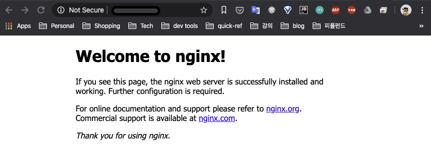
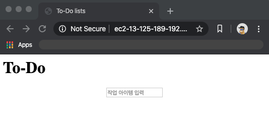

# 9장 운영 준비 배포 시작

> 여기서부터는 영문판 최신 버전을 기준으로 작성했습니다.
> 이유는 django 버전이 올라가고 리눅스 환경이 변해서 현재 버전이 더 적용하기 편하기 때문입니다.

## 우리가 해야 할 일 - 임시 방편 배포를 운영 준비 배포로 바꾸자

- 보통의 URL은 일반적으로 80 포트로 호스팅한다(현재는 8000포트).
- django dev server 는 보통 운영 환경해서는 사용하지 않는다.
  - 실제 운영 부하를 견디도록 설계 되지 않았다.
  - Nignx - Gunicorn 혹은 Python/WSGI server 조합을 많이 사용한다.
- `settings.py` 세틍이 운영환경에 맞게 되지 않았다.
  - `DEBUG=True` 같은 경우 운영환경에 피해야 한다.
  - `ALLOWED_HOSTS` 도 운영환경에 맞게 적용
  - `SECRET_KEY` - 유니크 키로 세팅
- 서버가 ssh 로 시작하도록 하지 않고, `systemd` 로 서버 재부팅에도 자동으로 시작하도록 설정되어야 한다

## Nginx로 전환

### 설치

다음과 같은 명령어로 설치한다.

```sh
webapp@server:$ sudo apt install nginx
webapp@server:$ sudo systemctl start nginx
```

사이트 IP 주소로 브라우저 접속해보면 "Welcome to nginx" 페이지를 볼 수 있다.



> 페이지가 계속 로딩중일 경우는 방화벽이 80포트(http) 막았기 때문일 것이다.
>
> 각 환경에 따라서 80포트를 풀어준다(AWS 경우는 EC2 Security Group 의 inbound 에 80 포트 등록)

### FT 는 실패하지만, nginx 는 실행 중 확인

포트 8000 번을 제외하고 FT를 실행하면, nginx 의 첫 화면을 언급하는 에러가 뜨면서 실패합니다.

```sh
$ STAGING_SERVER=staging.superlists.ml python manage.py test functional_tests
[...]
selenium.common.exceptions.NoSuchElementException: Message: Unable to locate
element: [id="id_new_item"]
[...]
AssertionError: 'To-Do' not found in 'Welcome to nginx!'
```

자 이제는 nignx가 django 가 연동되어 80번포트에 superlists 앱이 실행되도록 할 차례이다.

### 간단한 nginx 설정

스테이징 사이트에 대한 http 리퀘스트를 Django로 보내도록 알려주는 Nginx 설정 파일을 만든다. 최소 구성은 다음과 같다.

`server: /etc/nginx/sites-available/staging.superlists.ml`

```nginx
server {
    listen 80;
    server_name staging.superlists.ml;

    location / {
        proxy_pass http://localhost:8000;
    }
}
```

이 설정은 staging 도메인 만 수신하고,

모든 http 요청(80포트)을 localhost 8000 포트에 reverse proxy 한다.

즉  staging.superlists.ml 80포트 요청을 django 8000 포트가 응답을 받도록 한다.

이 파일이 nginx 설정에 적용되도록 하려면, `/etc/nginx/sites-available` 디렉토리에 `staging.superlists.ml` 파일로 저장한다.

이후 설정 활성화를 하려면 `/etc/nginx/sites-enabled/` 디렉토리에 해당 파일을 symlink로 연결한다.

```sh
# reset our env var (if necessary)
webapp@server:$ export SITENAME=staging.superlists.ml

webapp@server:$ cd /etc/nginx/sites-enabled/
webapp@server:$ sudo ln -s /etc/nginx/sites-available/$SITENAME $SITENAME

# check our symlink has worked:
webapp@server:$ readlink -f $SITENAME
/etc/nginx/sites-available/staging.superlists.ml
```

이것이 데비안/우분투에서 Nginx 구성을 저장하는 데 선호하는 방법이다.

즉, 실제 설정인 sites-available 과 symlink인 sites-enabled 로 별도 구성되어 있다.

장점은 개별 사이트를보다 쉽게 ​​켜거나 끌 수 있다는 것이다.


기본 설정의 혼동을 피하기 위해 "Welcome to Nginx" 설정을 지우는게 좋다.

```sh
webapp@server:$ sudo rm /etc/nginx/sites-enabled/default
```

마지막으로 설정을 테스트한 후, nginx 를 리로드하고, django를 리스타트 한다.

```sh
webapp@server:$ sudo systemctl reload nginx
webapp@server:$ cd ~/sites/$SITENAME
webapp@server:$ ./virtualenv/bin/python manage.py runserver 8000
```

FT를 80포트로 실행해보자.

```sh
$ STAGING_SERVER=staging.superlists.ml ./manage.py test functional_tests --failfast
[...]

...
 ---------------------------------------------------------------------
Ran 3 tests in 10.718s

OK
```

그린 상태로 다시 되돌아 왔다.

### Gunicorn 으로 전환

Gunicorn 설치부터 한다.

```sh
webapp@server:$ ./virtualenv/bin/pip install gunicorn
```

Gunicorn 실행하려면 wsgi 경로 위치를 알려줘야 한다. 장고는 이 실행 코드가 `superlists/wsgi.py` 에 위치한다.

```sh
webapp@server:~/sites/staging.superlists.ml$ ./virtualenv/bin/gunicorn superlists.wsgi:application
[2020-02-13 00:05:00 +0000] [2432] [INFO] Starting gunicorn 20.0.4
[2020-02-13 00:05:00 +0000] [2432] [INFO] Listening at: http://127.0.0.1:8000 (2432)
[2020-02-13 00:05:00 +0000] [2432] [INFO] Using worker: sync
[2020-02-13 00:05:00 +0000] [2435] [INFO] Booting worker with pid: 2435
```

자 다시 환경이 재구성 되었으니 FT 테스트를 해보자. 실패가 발생한다.

```sh
$ STAGING_SERVER=ec2-13-125-189-192.ap-northeast-2.compute.amazonaws.com python manage.py test functional_tests
$ STAGING_SERVER=staging.superlists.ml python manage.py test functional_tests
[...]
AssertionError: 117.0 != 512 within 10 delta
FAILED (failures=1)
```

브라우져로 띄워보면 화면이 깨져있다. CSS가 적용되어 있지 않다.

CSS가 깨진 이유는 Django dev 서버가 정적 파일을 알아서 제공하지만 Gunicorn은 그렇지 않기 때문이다.



### Nginx에서 정적 파일을 제공하기

문제를 발견했으니 한걸음 더 가보자.

먼저 장고 커맨드 `collectstatic` 로 정적 파일들을 nginx가 찾을 수 있는 경로로 복사한다.

```sh
webapp@server:$ ./virtualenv/bin/python manage.py collectstatic --noinput
[...]
15 static files copied to '/home/webapp/sites/staging.superlists.ml/static'
elspeth@server:$ ls static/
base.css  bootstrap
```

다음 Nginx에 설정에 두 번째 위치 directive를 추가하여 정적 파일 제공을 시작하도록 지시합니다.

```sh
server {
    listen 80;
    server_name superlists-staging.ottg.eu;

    location /static {
        alias /home/webapp/sites/staging.superlists.ml/static;
    }

    location / {
        proxy_pass http://localhost:8000;
    }
}
```

Nginx 와 Gunicorn 을 재시작합니다.

```sh
webapp@server:$ sudo systemctl reload nginx
webapp@server:$ ./virtualenv/bin/gunicorn superlists.wsgi:application
```

브라우저로 실행해보면 정상적으로 다시 화면이 보일 것이다. FT를 실행하여 검사해 보자.

```sh
$ STAGING_SERVER=staging.superlists.ml python manage.py test functional_tests
[...]

...
 ---------------------------------------------------------------------
Ran 3 tests in 10.718s

OK
```
