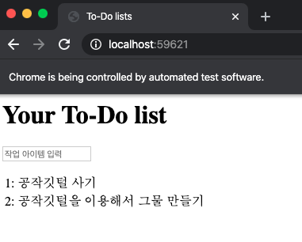
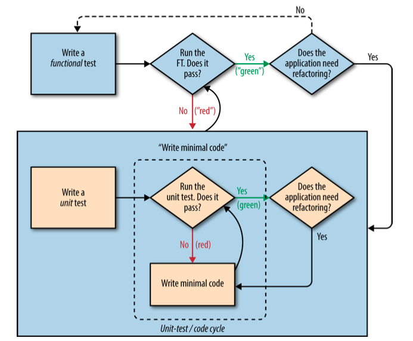

# 6장 최소 동작 사이트 구축

## Intro

이번장에 남은 일들

- 기능 테스트 후 남은 흔적(data) 제거
- 시스템이 하나의 목록만 지원하는 문제

## 기능 테스트 내에서 테스트 격리(예제 : [06-01](./06-01))

고전적 테스트 문제. 기능 테스트를 실행할 때마다 앞 테스트의 목록 아이템이 DB 에 남아있어 다음 테스트 결과를 방해함

해결 방식

1. 자체적인 솔루션을 적용하여 FT에 기존 결과물을 정리하는 코드를 작성하는 것
2. Django 에 탑재된 LiveServerTestCase 클래스를 이용하는 것

### LiveServerTestCase 클래스 동작

1. 자동으로 테스트용 데이터 베이스 생성
2. 기능 테스트를 위한 개발 서버를 가동
3. manage.py test 명령으로 실행 가능함

두 가지 해결방식중 LiveServerTestCase를 기능 테스트에 적용해보도록 한다

먼저 functional_tests.py를 장고 functional_tests 앱의 tests.py 로 이동시키는 작업을 해 보자.

```sh
$ cd superlists
$ mkdir functional_tests
$ touch functional_tests/__init__.py
```

장고 앱 디렉토리(혹은 파이썬 패키지)를 생성후 기존 기능 테스트 코드를 tests.py로 옮긴다.

```sh
$ cd ..
$ git mv functional_test.py superlists/functional_tests/tests.py
$ git status
```

현재 프로젝트 구조는 다음과 같이 변했다.


이제부터는 기능 테스트 실행은

`python functional_tests.py` 가 아니라

`python manage.py test functional_tests` 로 실행한다.

NewVisitorTest도 LiveServerTestCase를 상속하도록 테스트 코드도 변경해야 한다.

### [functional_tests/tests.py](./06-01/superlists/functional_tests/tests.py)

```py
from django.test import LiveServerTestCase
from selenium import webdriver
from selenium.webdriver.common.keys import Keys

class NewVisitorTest(LiveServerTestCase):
    
    def setUp(self):
   [...]
```

그리고 selenium 접속도 `localhost:8000` 대신에 LiveServerTestCase 제공하는 `self.live_server_url` 로 다시 세팅해야 한다.

```py
[...]
    def test_can_start_a_list_and_retrieve_it_later(self):
        # 에디스(Edith)는 멋진 작업 목록 온라인 앱이 나왔다는 소식을 듣고
        # 해당 웹 사이트를 확인하러 간다.
        self.browser.get(self.live_server_url)
        [...]
```

아래 부분도 없애도 된다. 테스트 실행을 장고 manage.py에서 대신하기 때문이다.

```py

if __name__ == '__main__':
    unittest.main(warnings='ignore')
```

변경이 다 되면 처음으로 바뀐 기능 테스트를 실행해 본다.

`python manage.py test functional_tests` 로 실행한다.

```sh
python manage.py test functional_tests
Creating test database for alias 'default'...
System check identified no issues (0 silenced).
F
======================================================================
FAIL: test_can_start_a_list_and_retrieve_it_later (functional_tests.tests.NewVisitorTest)
----------------------------------------------------------------------
Traceback (most recent call last):
  File "/Users/pilhwankim/Github/books/test_driven_development_with_python/ch06/06-01/superlists/functional_tests/tests.py", line 64, in test_can_start_a_list_and_retrieve_it_later
    self.fail('Finish the test!')
AssertionError: Finish the test!

----------------------------------------------------------------------
Ran 1 test in 7.799s

FAILED (failures=1)
Destroying test database for alias 'default'...
```

리펙터링 전과 같이 self.fail에 걸리며 통과 한다.

두번째 실행해보면 첫번째 실행한 목록이 남아있지 않은 것을 발견한다.



좋은 소식이 있다. 이제부터는 `manage.py test` 를 실행하면 기능 테스트와 단위 테스트 동시에 실행된다

```sh
$ python manage.py test
Creating test database for alias 'default'...
System check identified no issues (0 silenced).
.......F
======================================================================
FAIL: test_can_start_a_list_and_retrieve_it_later (functional_tests.tests.NewVisitorTest)
----------------------------------------------------------------------
Traceback (most recent call last):
  File "/superlists/functional_tests/tests.py", line 64, in test_can_start_a_list_and_retrieve_it_later
    self.fail('Finish the test!')
AssertionError: Finish the test!

----------------------------------------------------------------------
Ran 8 tests in 7.119s

FAILED (failures=1)
Destroying test database for alias 'default'...
```

단위 테스트만 실행하려면 `python manage.py test lists`을 실행하면 된다.

```sh
$ python manage.py test lists
Creating test database for alias 'default'...
System check identified no issues (0 silenced).
.......
----------------------------------------------------------------------
Ran 7 tests in 0.018s

OK
Destroying test database for alias 'default'...
```

## 필요한 경우 최소한의 설계를 하자 - Agile 개발 방법

- TDD 와 애자일(Agile) 은 밀접한 관련이 있다.
- 이론보다는 실제 상황을 통해 문제를 해결하려는 방식
- 긴 설계 과정 대신 "동작하는 최소한의 애플리케이션" 을 빠르게 만들고, 이를 이용해 얻은 실제 사용자 의견을 설계에 점진적으로 반영하는 방식
- 그러나 설계를 생각하지 않는 것은 아님
- 설계를 생각해서 해답을 빠르게 낼수 있다면 그렇게 해야 함

### 최소한의 기능을 가진 To-Do 앱(설계)

- 각 사용자별 개별 목록을 저장하도록 한다.
- 하나의 목록은 어러 개의 작업 아이템으로 구성된다. 이 아이템들은 작업 내용을 설명하는 텍스트다.
- 다음 방문 시에도 목록을 확인할 수 있도록 목롣을 저장해두어야 한다. 현 시점에선 각 목록에 해당하는 개별 URL을 사용자에게 제공하도록 한다. 이후에는 사용자를 자동으로 인식해서 해당 목록을 보여주도록 수정할 필요가 있다.

### YAGNI(You ain't gonna need it - "야그니" 라고 읽음)

- 아이디어가 아무리 좋더라도 대게 사용자가 사용하지 않으면 의미가 없다.
- 오히려 사용하지 않는 코드가 가득차서 앱이 복잡해지기만 한다.
- 아이디어를 억제하고 설계/개발을 최소화하는 것을 의미한다.

### REST(Representational State Transfer)

- 웹 설계 방법 중 하나
- 데이터 구조를 URL 구조에 일치시키는 방식
- 예시
  - To-Do 리스트 URL : `GET /lists/<목록 식별자>/`
  - 새로운 목록 만들기 : `POST /lists/new/`
  - 기존 목록에 새로운 작업 아이템 추가 : `POST /lists/<>/add_item`

추가하자면, REST의 정의에는 맞진 않는 설명이나, 이 책은 TDD를 주제로 하는 책이므로 이 정도 intro 설명으로 마무리하자.(이 친구가 상당히 논쟁거리이므로...)

## TDD를 이용한 새로운 설계 반영하기(예제 : [06-02](./06-02))

위의 설계 사항을 보고 우리가 앞으로 할 일을 다음과 같이 정리 가능하다.

### 작업 메모장

- [x] ~~FT가 끝난 후에 결과물을 제거한다~~
- [ ] 모델을 조정해서 아이템들이 다른 목록과 연계되도록 한다
- [ ] 각 목록별 고유 URL을 추가한다
- [ ] POST를 이용해서 새로운 목록을 생성하는 URL을 추가한다
- [ ] POST를 이용해서 새로운 아이템을 기존 목록에 추가하는 URL을 만든다.

새로운 기능과 설계를 적용하기 위해서, 4장에서 보았던 TDD 프로세스를 다시 한번 보자.



1장~6장 첫번째 예제까지 우리는 FT 단위의 TDD 프로세스를 한바퀴 돌았다(사실 2번 했다.)

이걸 다시 언급하는 이유는 이 프로세스가 저런 설계 명세가 있는 개발도 TDD 프로세스가 작동함을 저자가 보여주고 싶어서 인것 같다.

다시 FT 로 돌아와서 에디스가 첫 번째 아이템을 만들자 마자 새로운 목록을 만들어서 신규 작업 아이템을 추가한다.

그리고 그녀가 만든 목록에 접근할 URL을 제공하도록 FT 에 추가해 보자.

### [functional_tests/tests.py](./06-02/superlists/functional_tests/tests.py)

```py
[...]
        # 엔터키를 누르면 새로운 URL로 바뀐다. 그리고 작업 목록에
        # "1: 공작깃털 사기" 아이템이 추가된다
        inputbox.send_keys(Keys.ENTER)
        
        import time
        time.sleep(2)
        
        edith_list_url = self.browser.current_url
        self.assertRegex(edith_list_url, '/lists/.+')
        self.check_for_row_in_list_table('1: 공작깃털 사기')
[...]
```

그리고 테스트 마지막 부분을 수정해서 다른 사용자가 접속하는 경우를 고려한다.

- 다른 사람이 접속할 경우 에디스의 목록이 보이지 않는 것을 확인
- 각 사용자별 별도 URL이 생성되는지 여부 확인

self.fail 앞에 있는 주석 부터 지우고 다음과 같이 입력한다.

```py
        [...]
        # 페이지는 다시 갱신되고, 두 개 아이템이 목록에 보인다.
        self.check_for_row_in_list_table('1: 공작깃털 사기')
        self.check_for_row_in_list_table('2: 공작깃털을 이용해서 그물 만들기')

        # 새료운 사용자인 프란시스가 사이트에 접속한다.

        ## 새로운 브라우저 세션을 이용해서 에디스의 정보가
        ## 쿠키를 통해 유입되는 것을 방지한다
        self.browser.quit()
        self.browser = webdriver.Chrome('chromedriver')

        # 프란시스가 홈페이지에 접속한다.
        # 에디스의 리스트는 보이지 않는다.
        self.browser.get(self.live_server_url)
        page_text = self.browser.find_element_by_tag_name('body').text
        self.assertNotIn('공작깃털 사기', page_text)
        self.assertNotIn('공작깃털을 이용해서 그물 만들기', page_text)

        # 프란시스가 새로운 작업 아이템을 입력하기 시작한다.
        # 그는 에디스보다 재미가 없다.
        inputbox = self.browser.find_element_by_id('id_new_item')
        inputbox.send_keys('우유 사기')
        inputbox.send_keys(Keys.ENTER)

        # 프란시스가 전용 URL을 취득한다.
        francis_list_url = self.browser.current_url
        self.assertRegex(francis_list_url, '/lists/.+')
        self.assertNotEqual(francis_list_url, edith_list_url)
        
        # 에디스가 입력한 흔적이 없다는 것을 다시 확인한다.
        page_text = self.browser.find_element_by_tag_name('body').text
        self.assertNotIn('공작깃털 사기', page_text)
        self.assertIn('우유 사기', page_text)      

        # 만족하고 잠자리에 든다.
        [...]
```

FT를 실행해보면 예상되는 실패 결과가 나온다.

```sh
$ python manage.py test functional_tests
Creating test database for alias 'default'...
System check identified no issues (0 silenced).
F
======================================================================
FAIL: test_can_start_a_list_and_retrieve_it_later (functional_tests.tests.NewVisitorTest)
----------------------------------------------------------------------
Traceback (most recent call last):
  File "/Users/pilhwankim/Github/books/test_driven_development_with_python/ch06/06-02/superlists/functional_tests/tests.py", line 48, in test_can_start_a_list_and_retrieve_it_later
    self.assertRegex(edith_list_url, '/lists/.+')
AssertionError: Regex didn't match: '/lists/.+' not found in 'http://localhost:56148/'

----------------------------------------------------------------------
Ran 1 test in 6.322s

FAILED (failures=1)
Destroying test database for alias 'default'...
```
