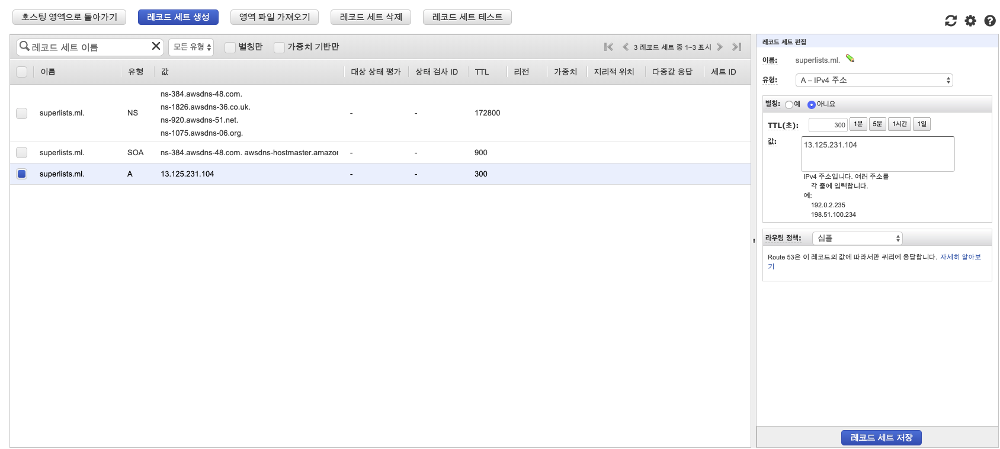
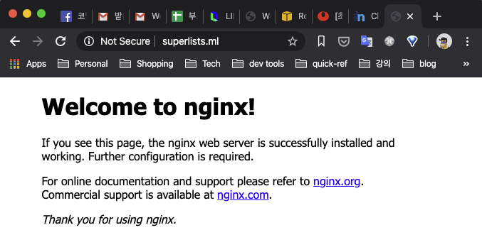
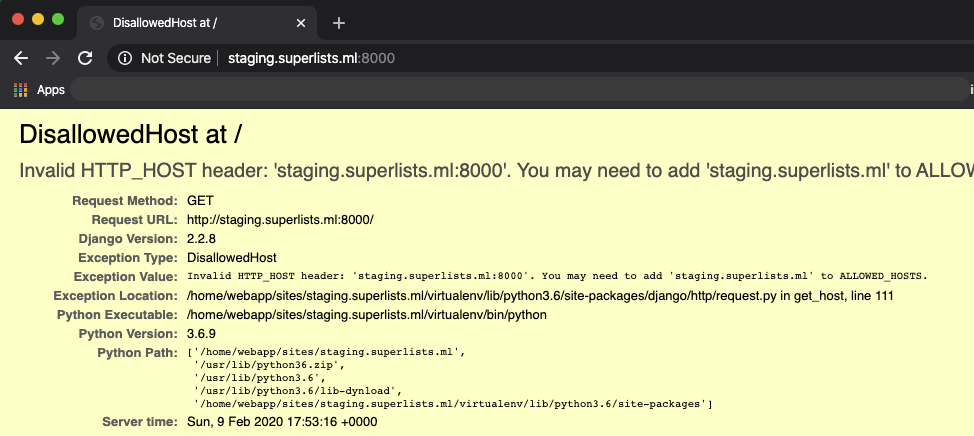
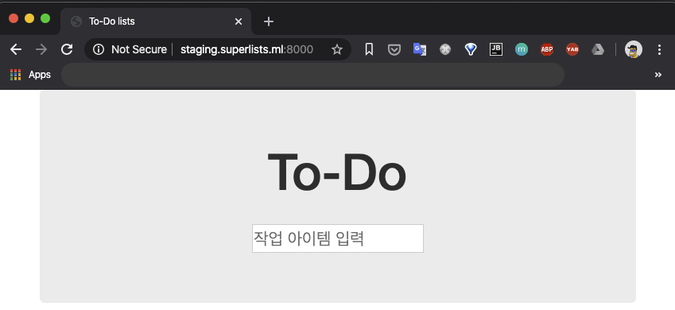
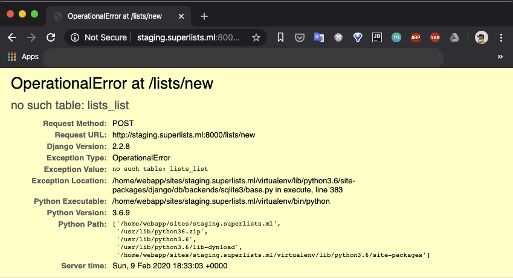

# 8장 스테이징 사이트를 이용한 배포 테스트

## 이번장에서 다루는 것

- 우리가 만든 사이트를 실제 운영 가능한 진짜 웹 서버에 배포하는 방법

### TDD와 배포시 주의가 필요한 사항

- 정적파일(css, javascript, image 등)
  - 제공을 위한 특수한 설정 필요

- 데이터베이스
  - 권한
  - 경로문제
  - 테스트 데이터 관리에 유의

- 의존관계
  - 연계된 패키지 설치
  - 패키지 버전 확인

### 해결책

- 실 운영 환경과 동일한 staging 사이트 마련. 배포 전에 제대로 동작하는지 확인
- 스테이징 사이트에 대해 기능 테스트를 실행할 수 있음
- virtualenv 로 파이썬 패키지 의존관계 관리
- 자동화, 자동화, 자동화 : 스크립트를 이용해 신규 버전 배포, 스테이징 운영 동시 배포하여 동일 상태 유지.

### 우리가 할일

1. 스테이징 서버에서 실행할 수 있도록 FT 수정
2. 서버를 구축하고 거기에 필요한 모든 소프트웨어 설치한다. 또한 스테이징과 운영 도메인이 이 서버를 가리키도록 설정한다.
3. git을 이용해서 코드를 서버에 업로드한다.
4. Django 개발 서버를 이용해서 스테이징 사이트에서 약식 버전의 사이트를 테스트한다.
5. Virtualenv 사용법을 배워서 서버에 있는 파이썬 의존 관계를 관리하도록 한다.
6. 과정을 진행하면서 항시 FT 를 실행한다. 이를 통해 단계별로 무엇이 동작하고, 무엇이 동작하지 않는지 확인한다.
7. Gunicorn, Upstart, 도메인 소켓 등을 이용하여 사이트를 운영 서버에 배포하기 위한 설정을 한다.
8. 설정이 정상적으로 동작하면 스크립트를 작성하여 수동으로 했던 작업을 자동화 하도록 한다. 이를 통해 사이트 배포를 자동화 할 수 있다.
9. 마지막으로, 동일 스크립트를 이용해서 운영 버전의 사이트를 실제 도메인에 배포하도록 한다.

## 항상 그렇듯이 테스트부터 시작 (예제 : [08-01](./08-01))

기능 테스트를 스테이징 사이트에서 실행되도록 하기

테스트 임시 서버가 실행되는 주소를 변경

### functional_tests/tests.py

```py
import sys

[...]
class NewVisitorTest(StaticLiveServerTestCase):
    @classmethod
    def setUpClass(cls):
        for arg in sys.argv:
            if 'liveserver' in arg:
                cls.server_url = 'http://' + arg.split('=')[1]
                return
        super().setUpClass()
        cls.server_url = cls.live_server_url

    @classmethod
    def tearDownClass(cls):
        if cls.server_url == cls.live_server_url
            super().tearDownClass()
```

`LiveServerTestCase`의 제약사항 - 자체 테스트 서버에서 샤용한다고 가정. 그래서 다음 변경사항 생김

- `setUpClass` : `unittest` 제공. 전체 테스트 클래스 실행시 1번 먼저 실행. 전체 클래스에 테스트 설정 제공
- `sys.argv`에 있는 `liveserver`라는 커맨드라인 인수를 찾음
- 이 인수를 찾으면 `setUpClass` 를 건너뛰옥 스테이징 서버 URL을 `server_url` 변수에 저장

따라서 `self.live_server_url` -> `self.server_url` 로 변경

### functional_tests/tests.py

```py
@@ -19,7 +34,7 @@
     def test_can_start_a_list_and_retrieve_it_later(self):
         # 에디스(Edith)는 멋진 작업 목록 온라인 앱이 나왔다는 소식을 듣고
         # 해당 웹 사이트를 확인하러 간다.
-        self.browser.get(self.live_server_url)
+        self.browser.get(self.server_url)

         # 웹 페이지 타이틀과 헤더가 'To-Do'를 표시하고 있다.
         self.assertIn('To-Do', self.browser.title)
@@ -69,7 +84,7 @@

         # 프란시스가 홈페이지에 접속한다.
         # 에디스의 리스트는 보이지 않는다.
-        self.browser.get(self.live_server_url)
+        self.browser.get(self.server_url)
         page_text = self.browser.find_element_by_tag_name('body').text
         self.assertNotIn('공작깃털 사기', page_text)
         self.assertNotIn('공작깃털을 이용해서 그물 만들기', page_text)
@@ -94,7 +109,7 @@

     def test_layout_and_styling(self):
         # 에디스는 메인 페이지를 방문한다
-        self.browser.get(self.live_server_url)
+        self.browser.get(self.server_url)
         self.browser.set_window_size(1024, 768)

         # 그녀는 입력 상자가 가운데 배치된 것을 본다
```

다른 부분에서 사이드 이펙트가 있는지 FT 를 실행한다.

```sh
    if cls.server_url == cls.live_server_url
                                           ^
SyntaxError: invalid syntax
```

책의 예제 그대로 따라하면 에러가 났다. 이유는 Django 의 버전에 따른 구현 방식이 바뀌었다. 

책의 저자는 이 문제에 대한 응답을 아래에 남겨놨다.

https://groups.google.com/forum/#!topic/obey-the-testing-goat-book/pokPKQQB2J8

단순하다 `tearDownClass` 메서드를 지울 것!

```py
class NewVisitorTest(StaticLiveServerTestCase):
    @classmethod
    def setUpClass(cls):
        for arg in sys.argv:
            if 'liveserver' in arg:
                cls.server_url = 'http://' + arg.split('=')[1]
                return
        super().setUpClass()
        cls.server_url = cls.live_server_url
```

다시 FT 를 실행해보면 잘 된다.

```sh
$ python manage.py test functional_tests
..
----------------------------------------------------------------------
Ran 2 tests in 17.007s
```

이제는 스테이징 서버 URL로 실행해보자.

```sh
$ python manage.py test functional_tests --liveserver=staging.ottg.eu:8000
usage: manage.py test [-h] [--noinput] [--failfast] [--testrunner TESTRUNNER]
                      [-t TOP_LEVEL] [-p PATTERN] [-k] [-r] [--debug-mode]
                      [-d] [--parallel [N]] [--tag TAGS]
                      [--exclude-tag EXCLUDE_TAGS] [--version] [-v {0,1,2,3}]
                      [--settings SETTINGS] [--pythonpath PYTHONPATH]
                      [--traceback] [--no-color] [--force-color]
                      [test_label [test_label ...]]
manage.py test: error: unrecognized arguments: --liveserver=staging.ottg.eu:8000
```

아예 옵션이 사라졌다! 이것도 검색해보면 장고 1.11 버전 이후로 `DJANGO_LIVE_TEST_SERVER_ADDRESS` 환경변수로 대체되었음을 알수 있었다.

https://docs.djangoproject.com/en/3.0/releases/1.11/#liveservertestcase-binds-to-port-zero

이대로는 근본적인 해결책을 찾아야 해서 저자는 어떻게 변경했는지 영문 공개 페이지를 확인했더니 내용이 상당히 바뀌어 있었다.

https://www.obeythetestinggoat.com/book/chapter_manual_deployment.html

변경했던 것들을 다시 되돌리고 아래와 같이 변경하자.

### [functional_tests/tests.py](./08-01/superlists/functional_tests/tests.py)

```py
import os

[...]
class NewVisitorTest(StaticLiveServerTestCase):

    def setUp(self):
        self.browser = webdriver.Chrome('chromedriver')
        self.browser.implicitly_wait(3)
+        staging_server = os.environ.get('STAGING_SERVER')  
+        if staging_server:
+            self.live_server_url = 'http://' + staging_server  

```

다시 FT 를 실행해보면 잘 된다.

```sh
$ python manage.py test functional_tests
Creating test database for alias 'default'...
System check identified no issues (0 silenced).
..
----------------------------------------------------------------------
Ran 2 tests in 14.670s

OK
```

`--liveserver` 옵션 대신에 환경변수 `STAGING_SERVER` 로 주소를 지정하면 원하는 대로 의도적인 실패가 발생함을 확인 가능하다.

```sh
$ STAGING_SERVER=superlists-staging.ottg.eu python manage.py test functional_tests
FE
======================================================================
ERROR: test_layout_and_styling (functional_tests.tests.NewVisitorTest)
----------------------------------------------------------------------
selenium.common.exceptions.NoSuchElementException: Message: no such element: Unable to locate element: {"method":"css selector","selector":"[id="id_new_item"]"}
  (Session info: chrome=79.0.3945.117)

======================================================================
FAIL: test_can_start_a_list_and_retrieve_it_later (functional_tests.tests.NewVisitorTest)
----------------------------------------------------------------------
Traceback (most recent call last):
  File "/superlists/functional_tests/tests.py", line 29, in test_can_start_a_list_and_retrieve_it_later
    self.assertIn('To-Do', self.browser.title)
AssertionError: 'To-Do' not found in 'superlists-staging.ottg.eu'

----------------------------------------------------------------------
Ran 2 tests in 8.546s

FAILED (failures=1, errors=1)
```

## 도메인명 취득

이후 실습을 위해 꼭 취득하라고 권장하고 있다. 무료로 도메인을 얻을수 있는 곳도 있으니 실습용으로 하나 장만하자.

https://freenom.com

여기에서 나는 `superlists.ml` 도메인을 취득했으니 이 기준으로 진행하도록 한다.


## 수동으로 서버를 호스트 사이트로 프로비저닝

### 배포 2단계

- 신규 서버를 프로비저닝(Provisioning) 해서 코드를 호스팅 할 수 있도록 한다.
- 신규 버전의 코드를 기존 서버에 배포한다.

프로비저닝 종류가 다양하다. 최적의 배포 솔루션도 많다.

But! 이해하려고 노력해야 한다. 다른 환경에서 개발해도 같은 원리를 적용할수 있도록

### 사이트를 호스트할 곳 정하기

두 가지 형태 존재
- 자체 서버(가상도 가능) 운영
- Platform-As-A-Service(PAAS) - Heroku, DotCloud, OpenShift, PythonAnywhere 등

PaaS 서비스 배포 방식은 비추천
- 범용성이 떨어짐(서로 다른 방식) 
- 자주 변경되는 프로세스
- 서비스 자체가 폐업이 일어나는 경우도 발생

SSH와 웹 서버 설정을 이용한 전통적 서버관리 방식을 배우도록 한다!

### AWS 계정 만들기

필자가 언급한 pythonAnywhere를 사용하려 했었다.

그러나 앞으로 실습하게 될 `sudo` 권한의 사용 제한과 nginx 설치가 불가능함을 확인했다.

따라서 아마존 AWS환경을 중심으로 실습을 하려고 한다.

먼저 회원가입을 해야하는데 아래 링크대로 따라하면 AWS 계정을 생성할 수 있다.

#### 계정 생성 - aws 공식 문서

https://aws.amazon.com/ko/premiumsupport/knowledge-center/create-and-activate-aws-account/

#### 계정 생성후 보안 조치 - 계정 해킹당한후 엄청난 과금이 생길 수 있으므로 세팅 필수

https://www.44bits.io/ko/post/first_actions_for_setting_secure_account

### 서버 구축하기

다음 조건에 구축하도록 함

- Ubuntu(13.04 이상) 가 설치
- root 권한 있을 것
- 인터넷 상에 공개되어 있을 것
- SSH 로 접속할 수 있을 것

우분투를 추천하는 이유
- Python 3.4 기본 탑재
- Nignx 설정이 쉬움

### EC2 인스턴스 생성

실제 생성 방법은 아래 블로그 글들을 참고 하자.

https://aws.amazon.com/ko/premiumsupport/knowledge-center/create-linux-instance/

https://victorydntmd.tistory.com/61

아래와 같이 생성하자.

- AMI : Ubuntu Server 18.04 LTS (HVM), SSD Volume Type
- Name : superlists-was
- Security group : superlists-was-sg
  - 포트 22 - 0.0.0.0/0
  - 포트 80 - 0.0.0.0/0

### 사용자 계정, SSH, 권한

이후부터 `sudo`권한을 가진 비루트 사용자 계정을 가지고 있다고 가정하고 진행

계정은 다음과 같은 shell 명령으로 실행한다.

```sh
# 아래 명령들은 root 사용자로 실행해야 한다.
# -m은 home 폴더 생성한다. -s는 webapp이 쉘 종류중에 bash를 사용하도록 한다.
root@localhost:$ useradd -m -s /bin/bash webapp
# webapp을 sudoers 그룹에 추가한다.
root@localhost:$ usermod -a -G sudo webapp
# webapp 패스워드 설정
root@localhost:$ passwd webapp
# webapp 으로 사용자 변경
root@localhost:$ su - webapp
```

ssh 패스워드 보다는 개인키(Private key)를 이용한 인증 방법을 쓰는 것이 좋음

Local PC 에서 공개키(Public key)를 가져다 서버의 `~/.ssh/authorized_key`에 추가하면 됨

아래 링크에 자세히 설명되어 있다.

https://www.linode.com/docs/security/authentication/use-public-key-authentication-with-ssh/

### Nginx 설치

`apt-get` 명령으로 거의 해결.

```sh
webapp@localhost:$ sudo apt update
webapp@localhost:$ sudo apt-get install nginx
webapp@localhost:$ sudo service nginx start
```

사이트 IP 주소로 브라우저 접속해보면 "Welcome to nginx" 페이지를 볼 수 있다.


페이지가 계속 로딩중일 경우는 방화벽이 80포트(http) 막았기 때문일 것이다.

각 환경에 따라서 80포트를 풀어준다(AWS 경우는 EC2 Security Group 에 inbound 80포트 등록)

이후 root 권한에서 필수 소프트웨어들을 설치한다

```sh
webapp@localhost:$ sudo apt-get install git python3 python3-pip
webapp@localhost:$ sudo pip3 install virtualenv
```

### 스테이징 서버와 운영 서버를 위한 도메인 설정

외부 무료 도메인과 AWS의 EC2 와 연결하려면 AWS ROUTE53 을 통해 연동해야 한다.

아래의 블로그를 보면 연동 방법이 자세이 나와 있다.

https://tech.cloud.nongshim.co.kr/2018/10/16/%EC%B4%88%EB%B3%B4%EC%9E%90%EB%A5%BC-%EC%9C%84%ED%95%9C-aws-%EC%9B%B9%EA%B5%AC%EC%B6%95-8-%EB%AC%B4%EB%A3%8C-%EB%8F%84%EB%A9%94%EC%9D%B8%EC%9C%BC%EB%A1%9C-route-53-%EB%93%B1%EB%A1%9D-%EB%B0%8F-elb/

1. Route 53에 외부에서 할당한 도메인을 Hosted Zone 에 등록한다.

2. 그 후에 A 레코드를 특정 EC2 public ip에 연결한다.



3. 도메인 제공 사이트로 되돌아가 Route53에서 제공하는 NameServer로 등록한다.


4. 등록을 마치고 도메인 주소로 브라우저에서 요청하면 nginx 화면이 뜬다.



## 코드를 수동으로 배포

- 스테이징 사이트에 코드를 복사해서 실행
- nginx와 django 가 제대로 상호작용 하는지 확인

책의 구성과 동일하게 소스 디렉토리를 구성하였다.
`webapp` 계정의 홈 디렉토리에 구성한다.

```sh
/home/webapp
├── sites
│   ├── www.live.my-website.com
│   │    ├── db.sqlite3
│   │    ├── manage.py
│   │    ├── [etc...]
│   │    ├── static
│   │    │    ├── base.css
│   │    │    ├── [etc...]
│   │    └── virtualenv
│   │         ├── lib
│   │         ├── [etc...]
│   │
│   ├── www.staging.my-website.com
│   │    ├── db.sqlite3
│   │    ├── [etc...]
```

- 각 사이트(스테이징, 운영, 기타 사이트)는 자체 폴더를 가진다.
- database, static 파일, virtualenv 파일, 소스코드 파일은 각각 폴더 안에 구성한다.

자 이제 다시 마련한 웹 서버에 ssh 로 접속해서 다음과 같이 소스를 git으로 복사해 오자.

```sh
webapp@server:$ export SITENAME=staging.superlists.ml
# you should replace the URL in the next line with the URL for your own repo
webapp@server:$ git clone git@github.com:PilhwanKim/superlists.git ~/sites/$SITENAME
Resolving deltas: 100% [...]
```

- export 커맨드는 bash의 지역 변수를 할당하는 것이다. 이전 인라인 환경변수와 비슷하지만, 같은 쉘의 모든 커맨드에 사용 가능하다.

- git clone 은 첫번째 매개변수인 URL 위치의 repo를 가져오는 것이다. 두번째 매개변수는 복사할 디렉토리 위치를 설정한다.

자 바로 superlists 를 실행해 보자.

```py
webapp@server:~$ cd ~/sites/$SITENAME
webapp@server:~/sites/staging.superlists.ml$ python3.6 manage.py runserver
Traceback (most recent call last):
  File "manage.py", line 10, in main
    from django.core.management import execute_from_command_line
ModuleNotFoundError: No module named 'django'

The above exception was the direct cause of the following exception:

Traceback (most recent call last):
  File "manage.py", line 21, in <module>
    main()
  File "manage.py", line 16, in main
    ) from exc
ImportError: Couldn't import Django. Are you sure it's installed and available on your PYTHONPATH environment variable? Did you forget to activate a virtual environment?
```

아직 Django가 설치되지 않았음을 알 수 있다.

## requirements.txt를 사용하여 Virtualenv 생성

프로젝트(spuerlists)의 Django와 그외 다른 패키지들을 설치할 때 고려사항

- 같은 버전 사용
- 개발, 운영 환경 동일해야 함

그래서 등장하는 것이 `virtualenv` 이다.
이것은 다른 곳에 설치된 다른 버전의 파이썬 패키지를 관리하기 위한 툴이다.

먼저 로컬 환경에 패키지 리스트를 저장해야 한다. 이 리스트 이름을 통상적으로 `requirements.txt` 이름으로 저장한다.

```sh
$ echo "Django==2.2.8
pytz==2019.3
selenium==3.141.0
sqlparse==0.3.0
urllib3==1.25.7" > requirements.txt
$ git add requirements.txt
$ git commit -m "Add requirements.txt for virtualenv"
```

이 내용을 원격 repo에 보내기 위해 push 한다.

```sh
$ git push
```

다시 운영 서버로 가서 해당 내용을 가져온다.

```sh
webapp@server:$ git pull
```

virtualenv를 생성하자.

```sh
webapp@server:~/sites/staging.superlists.ml$ pwd
/home/webapp/sites/staging.superlists.ml

webapp@server:~/sites/staging.superlists.ml$ python3 -m venv virtualenv

webapp@server:~/sites/staging.superlists.ml$ ls virtualenv/bin
activate  activate.csh  activate.fish  easy_install  easy_install-3.6  pip  pip3  pip3.6  python  python3  python3.6
```

앞으로 virtualenv 를 활성화 시키고자 하면 `source ./virtualenv/bin/activate` 를 하면 된다. 
가상환경의 python, pip를 실행하려면  `./virtualenv/bin` 디렉토리 내의 파일을 실행한다.

예로, `requirements.txt` 의 패키지를 pip로 설치하려면

```sh
webapp@server:~/sites/staging.superlists.ml$ ./virtualenv/bin/pip install -r requirements.txt
Collecting Django==2.2.8 (from -r requirements.txt (line 1))

[...]

Successfully installed Django-2.2.8 pytz-2019.3 selenium-3.141.0 sqlparse-0.3.0 urllib3-1.25.7
```

virtualenv 환경에서 `python` 을 실행하려면

```sh
webapp@server:~/sites/staging.superlists.ml$ ./virtualenv/bin/python manage.py runserver
Watching for file changes with StatReloader

[...]

February 08, 2020 - 21:44:10
Django version 2.2.8, using settings 'superlists.settings'
Starting development server at http://127.0.0.1:8000/
Quit the server with CONTROL-C.
```

### 이제부터 가능해진 작업들

* `git push & pull` - 서버와 코드를 주고받는 수단이 있다.
* `virtualenv` - 로컬과 python 실행환경이 같도록 함
* `requirements.txt` - 패키지도 같은 목록 같은 버전으로 설치 가능하게 목록화

## FT로 배포 작업 확인

로컬 PC에서 아래의 명령으로 FT를 실행하자. 방금 운영 서버에 띄운 django를 대상으로 테스트 한다.

`--failfast` 옵션은 테스트 중 1개라도 실패하면 전체 테스트가 종료하는 옵션이다.

```sh
$ STAGING_SERVER=staging.superlists.ml ./manage.py test functional_tests --failfast

[...]

AssertionError: 'To-Do' not found in 'staging.superlists.ml'
```

결과는 실패다. 디버깅이 필요한 시간이 되었다.

## 전혀 작동하지 않는 배포 디버깅

> AWS 의 경우 먼저 해당 운영 서버에 적용된 security group 의 8000 포트를 열어야 한다.

되돌아보면 장고 runserver 기본 port 는 8000 번이다. 기본 웹서버 포트는 80번이다.

그래서 방금 한 테스트에 `STAGING_SERVER` 환경변수를 8000포트로 맞추어 보았다.

```sh
$ STAGING_SERVER=staging.superlists.ml:8000 ./manage.py test functional_tests --failfast

[...]
AssertionError: 'To-Do' not found in 'staging.superlists.ml'
```

동작하지 않는다. `curl` 커맨트라인 명령으로 http 접속 자체를 확인해보자.

local pc에서 아래 명령을 쳐보자.

```sh
$ curl staging.superlists.ml:8000

curl: (7) Failed to connect to staging.superlists.ml port 8000: Connection refused

```

결과는 연결이 거부되었다고 나온다. 연결이 거부되었다고???

제대로 운영 서버에 8000번 포트에 웹 서버가 띄워져 있는지 확인하기 위해 운영서버 내부에서 `curl` 요청을 해보자.

```sh
webapp@server:~$ curl localhost:8000
<!DOCTYPE html>
<html lang="en">
  <head>

    [...]
    <title>To-Do lists</title>
    [...]

  </body>
</html>
```

HTML 본문이 나오는 것을 확인했다. 운영서버 내부에서 localhost로 접속이 잘 된다. 어찌된 일일까?

실제로 우리가 runserver를 실행할 때 Django가 이전에 출력 한 결과에 실마리가 있다.

```sh
Starting development server at http://127.0.0.1:8000/
```

Django의 개발 서버는 "localhost" 를 가리키는 IP 주소 인 127.0.0.1을 listen 하도록 설정되어 있다. 

그러나 우리는 현재 운영 서버의 "실제" 공개 주소를 통해 외부에서 접근하려고 한다. 그러나 Django는 기본적으로 해당  주소를 listen 하지 않는다.

모든 주소를 듣도록하자. Ctrl-C를 사용하여 실행 서버 프로세스를 중단하고 다음과 같이 다시 시작하면 된다.

```sh
webapp@server:~/sites/staging.superlists.ml$ ./virtualenv/bin/python manage.py runserver 0.0.0.0:8000

[...]

Starting development server at http://0.0.0.0:8000/
Quit the server with CONTROL-C.
```

먼저 서버 내부에서 http 요청을 하면 잘 동작한다.

```sh
webapp@server:$ curl localhost:8000

<!DOCTYPE html>
[...]
</html>

```

local pc 에서 요청하면 어떨까?

```
$ curl staging.superlists.ml:8000
<!DOCTYPE html>
<html lang="en">
[...]
</body>
</html>
```

뭔가 html 응답이 왔다! 연결은 된 것이다.

다시 FT를 실행해 보자.

```sh
$ STAGING_SERVER=staging.superlists.ml:8000 ./manage.py test functional_tests --failfast
Creating test database for alias 'default'...
System check identified no issues (0 silenced).
F
======================================================================
FAIL: test_can_start_a_list_and_retrieve_it_later (functional_tests.tests.NewVisitorTest)
----------------------------------------------------------------------
Traceback (most recent call last):
  File "/superlists/functional_tests/tests.py", line 29, in test_can_start_a_list_and_retrieve_it_later
    self.assertIn('To-Do', self.browser.title)
AssertionError: 'To-Do' not found in 'DisallowedHost at /'

----------------------------------------------------------------------
Ran 1 test in 4.035s

FAILED (failures=1)
Destroying test database for alias 'default'...
```

에러가 바뀌었다. 다시 curl 결과를 다시 확인할 필요가 있다.

## settings.py 의 ALLOWED_HOSTS 해킹(예제 : [08-02](./08-02))

이 문제를 쉽게 해결할 수 있긴 하지만 좀 더 내용을 파보자.

이 사이트를 브라우저에서 열어보자.



ALLOWED_HOSTS는 위조, 파손, 악의적인 요청을 거부하도록 하는 보안 설정이다.(HTTP 요청에는 "호스트"라는 헤더에 의도된 주소가 포함되어 있음)

기본적으로 `DEBUG = True` 인 경우,

ALLOWED_HOSTS는 django를 기동하는 머신의 로컬 호스트를 허용하여 개발자 및 서버 자체 (localhost 로 요청)요청은 받아들이지만,
 
머신 외부 요청은 거부한다(staging.superlists.ml로 요청).

> 세부사항 참고:  https://docs.djangoproject.com/en/2.2/ref/settings/#std:setting-ALLOWED_HOSTS

결론은 settings.py에서 ALLOWED_HOSTS를 조정해야 한다. 

일단은 해킹중이므로 모든 허용 "*" 으로 설정한다.

### [superlists/settings.py](./08-02/superlists/superlists/settings.py)

```py
[...]
# SECURITY WARNING: don't run with debug turned on in production!
DEBUG = True

-ALLOWED_HOSTS = []
+ALLOWED_HOSTS = ['*']

[...]
```

해당 내용을 local pc 에서 편집후 git push를 하고

```sh
$ git commit -am "hack ALLOWED_HOSTS to be *"
$ git push
```

운영 서버에서 git pull 하여 반영후, runserver 를 재시작 해보자.

```sh
webapp@server:$ git pull
webapp@server:$ ./virtualenv/bin/python manage.py runserver 0.0.0.0:8000
```

브라우저로 접속해보면 우리가 익숙히 보던 메인 페이지가 나온다.



다시 기능테스트도 확인해 보자.

```sh
$ STAGING_SERVER=staging.superlists.ml:8000 ./manage.py test functional_tests --failfast
[...]
selenium.common.exceptions.NoSuchElementException: Message: no such element: Unable to locate element: {"method":"css selector","selector":"[id="id_list_table"]"}
  (Session info: chrome=79.0.3945.130)
[...]

FAILED (errors=1)
Destroying test database for alias 'default'...
```

기능 테스트 중에 발생한 장고 디버그 페이지는 좀 더 상세한 에러가 발생한 원인을 보여준다.



이 에러가 발생한 이유를 곰곰히 생각해보자면, 우리가 데이터베이스를 운영 환경에 셋업을 하지 않았음을 알수 있다.

자 다음으로 운영환경에 데이터베이스를 셋업하자.
